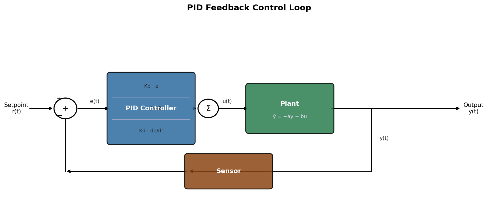
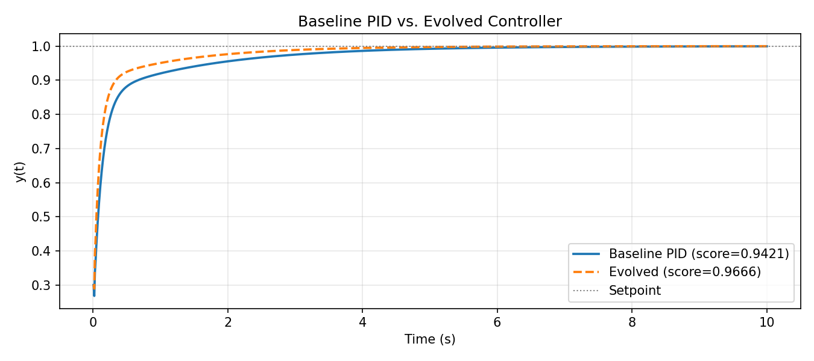
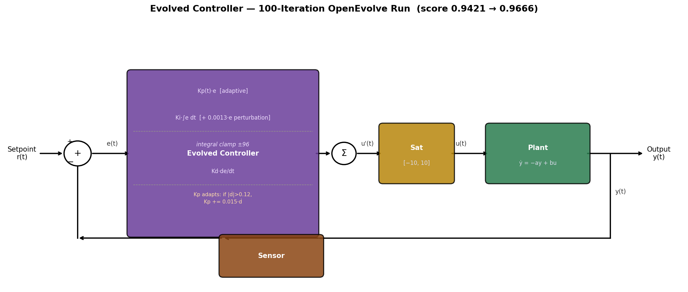

# Controller-Search

Can an LLM discover a better feedback controller than a human-tuned PID — without being given any control theory?

This project uses [OpenEvolve](https://github.com/algorithmicsuperintelligence/openevolve) (an open-source AlphaEvolve implementation) to search for controller programs by mutating Python code with an LLM and scoring each candidate on a simulated plant. After 100 iterations it found a controller that reduces tracking error by **44%** while maintaining zero overshoot.

---

## The Problem

We want a controller that drives the output of a physical system to a desired setpoint as quickly and accurately as possible.

The system (plant) is a **first-order linear system**:

```
dy/dt = -a·y + b·u     (a = 2,  b = 3)
```

- `y(t)` is the measured output (e.g. temperature, position)
- `u(t)` is the control signal (e.g. heater power, motor torque), clipped to `[-10, 10]`
- The controller sees `setpoint` and `y(t)` and must produce `u(t)` at each timestep (`dt = 0.01s`)

The controller is evaluated across **three setpoints** (`0.5`, `1.0`, `2.0`) over 10 seconds each. A good controller gets close to the setpoint quickly, doesn't overshoot, and has near-zero steady-state error.

---

## The Baseline: Hand-Tuned PID

The standard approach is a **PID controller** — a three-term formula that combines proportional, integral, and derivative feedback:

```
u(t) = Kp·e + Ki·∫e dt + Kd·de/dt
```

where `e = setpoint - y` is the error at each step.



The baseline gains were chosen by hand to give good transient response without overshoot:

| Parameter | Value | Reasoning |
|---|---|---|
| `Kp = 3.0` | Proportional | Moderate response; higher causes overshoot without integral clamping |
| `Ki = 2.0` | Integral | Eliminates steady-state error; higher causes windup |
| `Kd = 0.1` | Derivative | Small damping term; too high amplifies noise |

This gives a solid but conservative controller — it settles cleanly but rises slowly because the gains are kept low to avoid instability.

---

## Scoring

Each candidate is scored on three criteria, averaged across the three setpoints:

```
score = 0.5 × score_ISE  +  0.3 × score_overshoot  +  0.2 × score_ss_error

where:
  score_ISE       = 1 / (1 + ISE)              ISE = ∫(setpoint − y)² dt
  score_overshoot = 1 / (1 + 5·overshoot)
  score_ss_error  = 1 / (1 + 20·ss_error)
```

ISE (Integral Squared Error) is the dominant term — it penalises both how large the error is and how long it persists. The baseline already achieves **zero overshoot** and near-zero steady-state error, so almost all remaining headroom is in reducing ISE by rising faster.

| Metric | Baseline PID | Maximum possible |
|---|---|---|
| score | 0.9421 | 1.0 |
| ISE | 0.1262 | 0.0 |
| overshoot | 0.0 | 0.0 |
| ss_error | 0.0005 | 0.0 |

---

## The Approach: LLM-Guided Program Evolution

Instead of hand-tuning, we let an LLM mutate the controller code and keep the best versions. The search is structured as follows:

1. The **initial program** is the baseline PID, with `EVOLVE-BLOCK` markers around the code the LLM is allowed to change
2. At each iteration, OpenEvolve picks a high-scoring parent program, asks the LLM to mutate it, and scores the result
3. The population is maintained via **MAP-Elites** — a quality-diversity algorithm that keeps a grid of programs sorted by behavioural characteristics (here: code complexity and diversity), not just the single best score. This prevents the search from converging too early on one local optimum — a mediocre but structurally different program in a corner of the grid can later produce a breakthrough mutation
4. The LLM has no constraint on controller structure — it can change the gains, add new logic, or implement an entirely different control law, as long as the class interface is preserved

The LLM backend is `Qwen2.5-Coder-14B-Instruct` running locally via vLLM on a single NVIDIA L40S GPU (46GB VRAM).

---

## What the LLM Found

After 100 iterations (~40 minutes), the best program was found at iteration 98.



The evolved controller rises to setpoint roughly **twice as fast** in the first second, then settles smoothly with no overshoot. The result:

| Metric | Baseline PID | Best Evolved | Change |
|---|---|---|---|
| score | 0.9421 | **0.9666** | +2.6% |
| ISE | 0.1262 | **0.0709** | −44% |
| overshoot | 0.0 | 0.0 | — |
| ss_error | 0.0005 | **0.000079** | −84% |

The evolved controller is still a PID — the LLM didn't invent a new control law — but it made four targeted modifications:



| Modification | What it does | Why it helps |
|---|---|---|
| **Higher gains** `Kp=3.8, Ki=2.8, Kd=0.12` | More aggressive response | Faster rise, lower ISE |
| **Integral anti-windup clamp `±96`** | Limits how much the integral can accumulate | *Unlocks* the higher gains — without this, higher `Ki` causes windup and overshoot |
| **Adaptive Kp** — `if \|de/dt\| > 0.12: Kp += 0.015 · de/dt` | Temporarily increases proportional gain when the error is changing fast | Extra kick at the start of the transient, backs off automatically as the system settles |
| **Integral perturbation** `+= 0.0013 · error` | Adds a small proportional term directly into the integral accumulator | Leaky integrator effect — speeds up integral action early without increasing `Ki` globally |

**The key insight the LLM discovered:** the integral clamp and higher gains are co-dependent. Raising `Kp` or `Ki` alone on the baseline causes overshoot (the integrator winds up during the transient and overshoots when it unwinds). The LLM found the gains and the clamp together — a coupling that is non-obvious to tune by hand.

### The evolved code

```python
class Controller:
    def __init__(self, dt: float):
        self.dt = dt
        self.Kp = 3.8
        self.Ki = 2.8
        self.Kd = 0.12
        self.integral = 0.0
        self.prev_error = 0.0
        self.prev_derivative = 0.0
        self.adaptive_gain = 0.015
        self.integral_limit = 96.0

    def compute(self, setpoint: float, measurement: float) -> float:
        error = setpoint - measurement
        derivative = (error - self.prev_error) / self.dt
        self.integral += error * self.dt

        # Small perturbation to enhance responsiveness
        self.integral += 0.0013 * error

        # Integral anti-windup clamp
        self.integral = max(min(self.integral, self.integral_limit), -self.integral_limit)

        # Adaptive Kp: boost proportional gain during fast transients
        if abs(derivative) > 0.12:
            self.Kp += self.adaptive_gain * derivative

        u = self.Kp * error + self.Ki * self.integral + self.Kd * derivative
        u = max(min(u, 10), -10)

        self.prev_error = error
        self.prev_derivative = derivative
        return u
```

---

## Limitations

- **The plant model is known to the LLM.** The plant equation (`dy/dt = -a*y + b*u, a=2, b=3`) appears in the docstring that is passed to the LLM in every prompt. The LLM could in principle use this to derive near-optimal gains analytically rather than discovering them purely by trial and error. A stricter experiment would withhold the plant parameters.
- **Simulated plant only.** The controller is never tested on real hardware. Real systems have noise, delays, model mismatch, and nonlinearities that would likely require a different approach.
- **Small search budget.** 100 iterations with a single-threaded worker is a very short run. More iterations, more islands, or parallel workers would likely find better solutions.
- **Only three setpoints.** Generalisation to unseen setpoints or time-varying references is untested.

---

## Next Steps

- Run more iterations (500–1000) with the current setup — the score was still improving at iteration 98
- Withhold plant parameters from the LLM docstring to test whether the search is truly model-free
- Test on a higher-order or nonlinear plant where PID alone is insufficient
- Allow the LLM to use `import numpy` or `import scipy` — currently limited to pure Python — which would unlock model-based and optimal control structures
- Evaluate the best evolved controller on held-out setpoints and disturbance rejection

---

## Repository Layout

```
src/
  initial_program.py   Baseline controller with EVOLVE-BLOCK markers (the seed)
  evaluator.py         evaluate(program_path) → metrics dict
  controller.py        PIDController class + simulate() utility
  plot_pid.py          Draws the baseline PID block diagram
  plot_evolved.py      Draws the evolved controller block diagram
config.yaml            OpenEvolve configuration (model, iterations, population)
evolve_controller.ipynb  Main notebook: start vLLM, score baseline, run evolution, plot
openevolve_output/
  best/best_program.py   Best evolved controller found so far
```

---

## Running

### Open the notebook

```bash
cd /projectnb/rnn-models/bddepasq/Controller-Search
jupyter notebook evolve_controller.ipynb
```

Select the **Controller-Search (.venv)** kernel, then run cells in order:

| Cell | What it does |
|---|---|
| Setup | Imports, sets paths, loads config |
| Credentials | Reads `.env`, sets API key for local vLLM |
| Start vLLM | Launches `Qwen2.5-Coder-14B-Instruct` on GPU 0 (~2 min to load) |
| Baseline | Scores the hand-tuned PID |
| Run Evolution | Runs OpenEvolve for `max_iterations` (~40 min for 100) |
| Plot | Compares best evolved controller vs. baseline |

Evolution results are saved to `openevolve_output/` and can be resumed if interrupted.

### Switching models

Edit `config.yaml` and the vLLM start cell together. Models that fit on a single L40S (46GB):

| Model | VRAM | Notes |
|---|---|---|
| `Qwen/Qwen2.5-Coder-14B-Instruct` | ~28GB | Recommended — fast, good code quality |
| `Qwen/Qwen2.5-Coder-7B-Instruct` | ~14GB | Faster, slightly less capable |
